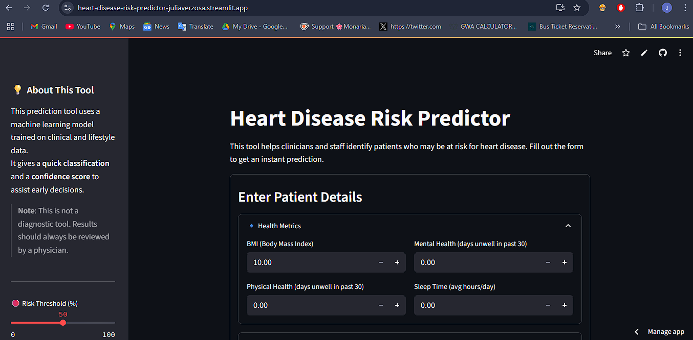
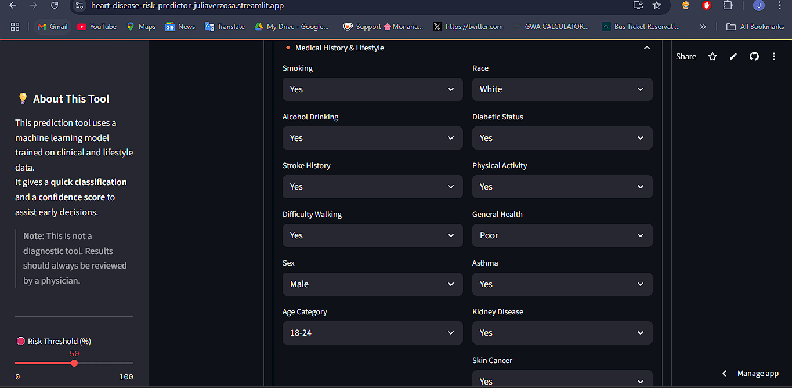
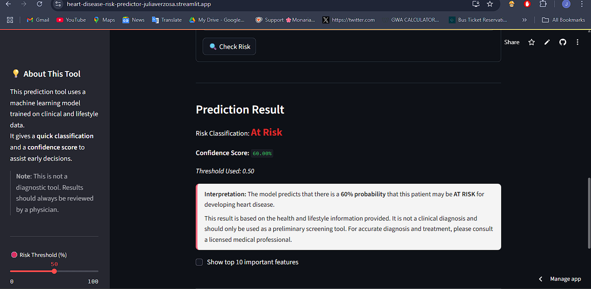

# Heart Disease Risk Predictor

A user-friendly web application that uses machine learning to help identify individuals at risk for heart disease. Designed for clinicians, healthcare workers, and early screening scenarios, this tool provides an instant prediction based on lifestyle and clinical data inputs.

---

## 🩺 About the App

This project is a **heart disease risk screening tool** built with:

- **Streamlit** – Python-based web app framework
- **scikit-learn** – for model training and prediction
- **Custom CSS** – for a clean and responsive UI

Users can input patient information such as age, BMI, smoking habits, diabetic status, and more. The app instantly classifies the risk as **"At Risk"** or **"Not At Risk"**, provides a **confidence score**, and displays a **feature importance chart** to explain the prediction.

---

## 🤖 Machine Learning Model

The app uses a **Random Forest Classifier** trained on the [Heart Disease 2020 dataset](https://www.kaggle.com/datasets/kamilpytlak/personal-key-indicators-of-heart-disease).

### 🔁 Model Pipeline

- **Data Cleaning**: Removed duplicates and handled missing values
- **Numerical Scaling**: Standardized using `StandardScaler`
- **Categorical Encoding**: Applied `OneHotEncoder`
- **Classifier**: `RandomForestClassifier` with 100 estimators and `random_state=42`
- **Train-Test Split**: 80% training, 20% testing

> ✅ Achieved ~**85–87% accuracy** on test data.

### 📦 Model Artifacts

- `model_pipeline.pkl` – Serialized model pipeline
- `feature_metadata.json` – Stores feature names and types

---

## 🖼️ Screenshots

### Home Page  


### Input Form  


### Prediction Output  


---

## 🚀 Installation

1. **Clone the repository**  
   ```bash
   git clone https://github.com/yourusername/heart-disease-risk-predictor.git
   cd heart-disease-risk-predictor
   ```

2. **Create a virtual environment**  
   ```bash
   python -m venv venv
   source venv/bin/activate  # On Windows: venv\Scripts\activate
   ```

3. **Install dependencies**  
   ```bash
   pip install -r requirements.txt
   ```

4. **Run the app**  
   ```bash
   streamlit run app.py
   ```

---

## 🧪 Usage

1. Launch the app in your browser.
2. Fill in the patient information in the input form.
3. Click **"Check Risk"** to see the result.
4. View the risk classification, confidence score, and feature importance chart.

---

